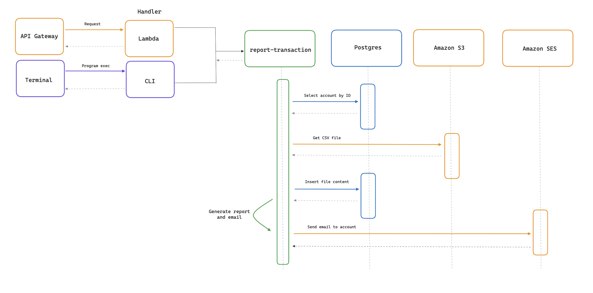
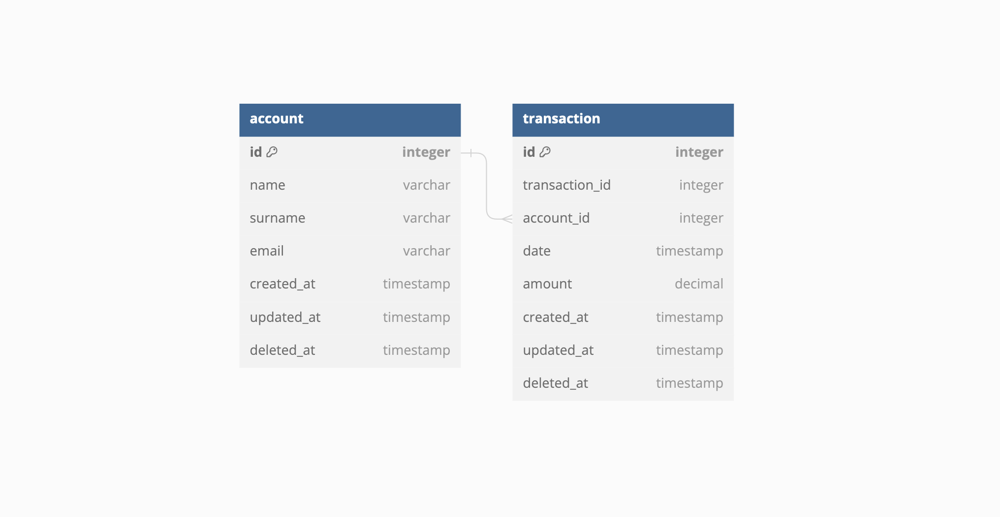

# report-transaction

Service in charge of generating and notifying user transaction reports.

## Content

1. [Introduction](#introduction)
2. [Quick start](#quick-start)
3. [Local testing](#local-testing)
4. [Program modes](#program-modes)
	1. [CLI](#cli)
	2. [Lambda](#lambda)
5. [Configuration](#configuration)
6. [Dependencies](#dependencies)
7. [Project structure](#project-structure)


## Introduction

The aim of this project is to create a flexible program able to be run in any mode or deployed in any environment 
needed. Currently, there is support to execute it as a CLI application or as a Lambda, but potentially, it can be 
extended to support any other mode you want. <br>
The program objective is to process a CSV file stored in Amazon [S3](https://aws.amazon.com/s3/) that contains a list of 
credit and debit transactions of an account. It receives the filename and account ID and generates a report with 
information extracted from the file. Once generated, an email will be sent to the account owner using Amazon 
[SES](https://aws.amazon.com/ses/). <br>

An example summary email will contain:
- Total balance
- Average total debit
- Average total credit
- Average debit and credit grouped by month
- Total transactions grouped by month

### Execution flow


### Database schema


## Quick start

**1.** Clone the repository:

```shell
$ git clone git@github.com:ifarinho/report-transaction.git
```

**2.** Build the image
```shell
$ make build-image
```

**3.** Done!

## Local testing

For local testing the image you can run the program in CLI mode. Keep in mind that you will need valid AWS credentials
and a proper user that have permissions to both S3 and SES. For the database, you could just use a Postgres image.

**1.** Generate a local `.env` file and set the corresponding values. Check the [configuration](#configuration) section
for hints.

```shell
$ make dotenv
```

Optionally, you can generate a CSV file with random values with a script in `scripts/` using Python. The file will be
created at the root level of the project with the name `txns.csv`:
```shell
$ python scripts/generate_csv.py
```

**2.** Run the program locally. Example where `txns.csv` is the filename and `69420` is the account ID:

```shell
$ make local FILENAME=txns.csv ACCOUNT=69420
```

## Program modes

The program can run in two different modes: CLI and Lambda. The mode must be set via an environmental variable, but 
more on that in the [configuration](#configuration-and-environmental-variables) section.

### CLI

The program must be run with two arguments:
- `filename`: string. The CSV filename inside the S3 Bucket. Don't include the Bucket name or the prefix, these values
are loaded via env.
- `account`: uint. The account ID related to the file.

### Lambda

The program is also ready to be deployed with AWS Lambda. For this particular case, you will need to set `RUN_MODE` to 
`2` (Lambda) and allowed cors origin with `CORS_ORIGIN`. Program arguments are no longer needed and can be ignored.

## Configuration

Some environmental variables must be set to the program be able to run, also there some optional ones related to the
specific run mode. A `template.env` file with reference values is provided.

#### General

- `RUN_MODE`: Set the program run mode.
  - `1`: CLI mode
  - `2`: Lambda mode
- `SERVICE_EMAIL`: Sender email address, this must be verified by AWS SES and the user must be in the right group with 
permissions to use the service.
- `CORS_ORIGIN`: Cors origin rules for the API Gateway. This value is not needed for the program to run in CLI mode.

#### Amazon

- `AWS_ACCESS_KEY_ID`: AWS access key ID.
- `AWS_ACCESS_SECRET_KEY`: AWS access secret key.
- `AWS_CREDENTIAL_TOKEN`: This variable is optional.
- `AWS_REGION`: Region.
- `AWS_S3_BUCKET`: Bucket name. Ex: `report-transaction`.
- `AWS_S3_PREFIX`: File prefix. Ex: `account`. The full path would be `report-transaction/account/<id>/<file>`.

#### Postgres

- `DB_POSTGRES_HOST`: Database host.
- `DB_POSTGRES_USER`: Database user.
- `DB_POSTGRES_PASSWORD`: User password.
- `DB_POSTGRES_NAME`: Database name.
- `DB_POSTGRES_PORT`: Database exposed port.
- `DB_POSTGRES_SSL_MODE`: Enable/disable SSL mode.
- `DB_POSTGRES_TIME_ZONE`: Database timezone.
- `DB_POSTGRES_DATA_SOURCE_NAME`: Connection string generated from all the previous values.

## Dependencies

The program uses some dependencies to execute Postgres database operations, connect to Amazon services and handle 
transaction amounts more precisely using fixed points decimals.

- [GORM](https://gorm.io/): Full featured ORM to handle SQL databases.
- [Postgres driver](https://github.com/go-gorm/postgres): Driver used by GORM  to execute database operations.
- [Amazon SDK](https://github.com/aws/aws-sdk-go): Official SDK tools to consume AWS services.
- [shopspring/decimal](https://github.com/shopspring/decimal): Arbitrary-precision fixed-point decimal numbers with GORM
and SQL compatibility.

## Project structure

The project is not following any specific rule, just some common conventions from this 
[repository](https://github.com/golang-standards/project-layout) and experience from past developments. This structure
aims to prevent circular import errors and to be as simple as possible to organize packages by function.

- `/`: Project directories. Build, instructions and template files.
  - `cmd`:
    - `app`: Application `main.go` file.
  - `assets`: Miscellaneous support files.
  - `internal`:
    - `app`:
      - `args`: Program arguments definitions and parsing.
      - `awsdk`: AWS session initialization, clients and services methods.
      - `db`: Postgres database connection and repository methods.
      - `env`: Environmental variables load.
      - `file`: CSV file reading.
      - `notification`: Email creation and sending.
      - `tools`:
        - `calculate`: Calculation and numeric parsing operations.
        - `datetime`: Time related functions.
        - `decode`: Deserialization and decoding functions.
        - `stringify`: To string conversion.
      - `transaction`: Transaction manipulation and Report generation.
    - `pkg`:
      - `event`: Main program execution process and run mode. Other modes should be added here.
  - `scripts`: Collection of scripts used in the project.
  - `web`:
    - `templates`: HTML email template.
